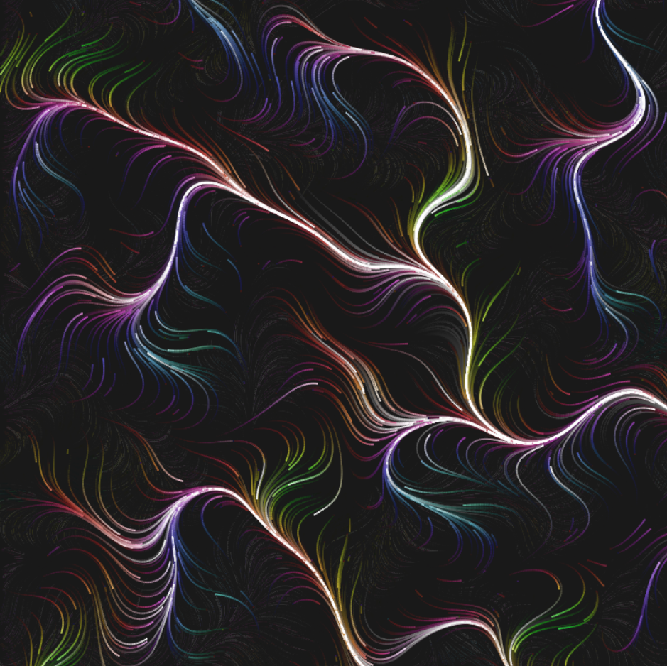

A particle animation in vanilla JavaScript.

[Live Demo](https://courageous-buttercream-3216a5.netlify.app)

# Installation
```
npm install
npm run dev
```

---

This uses the following library for 2d Perlin noise generation: [https://github.com/joeiddon/perlin](https://github.com/joeiddon/perlin).


